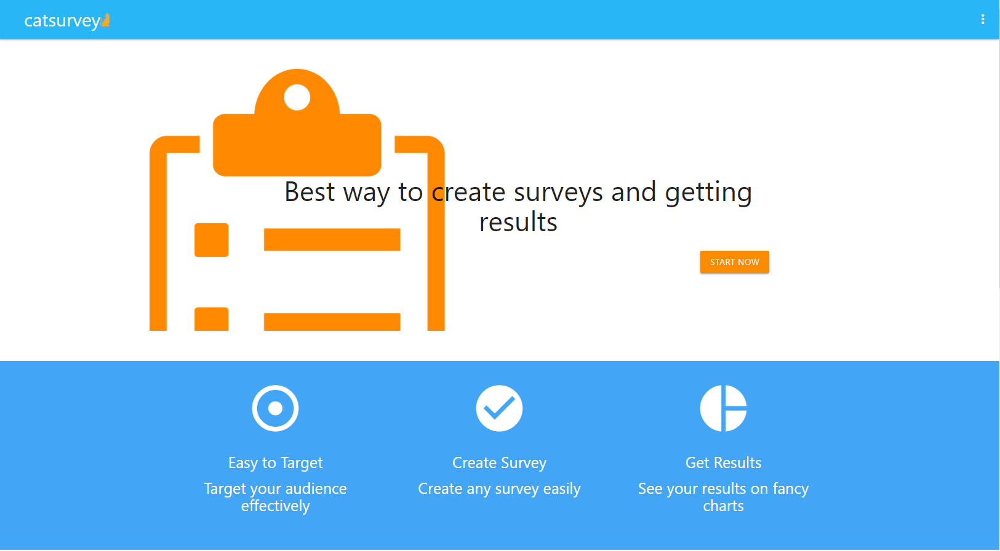
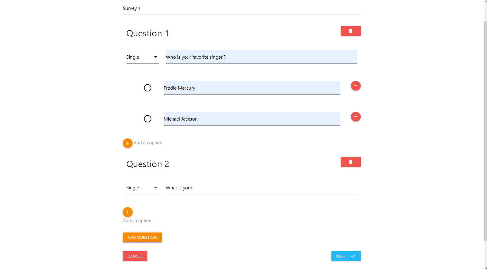
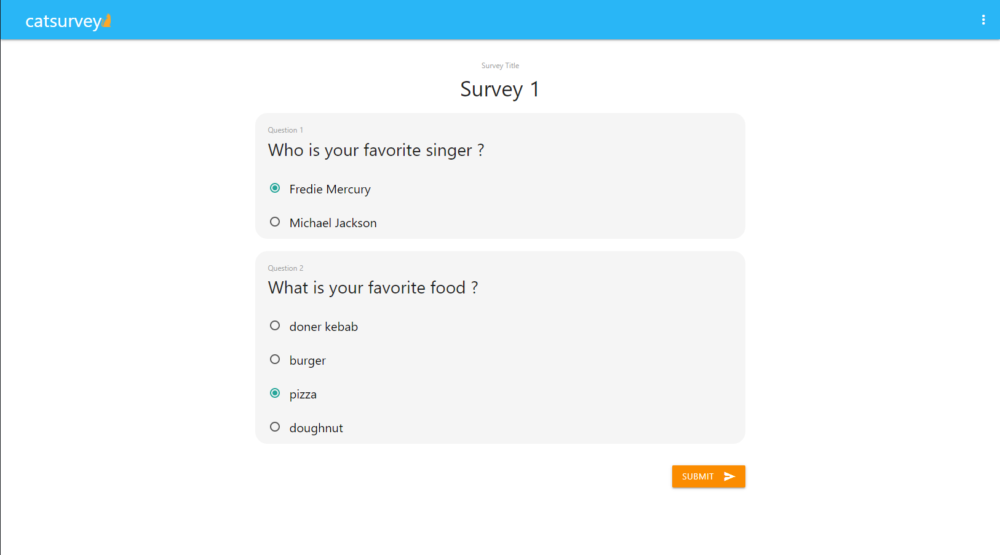
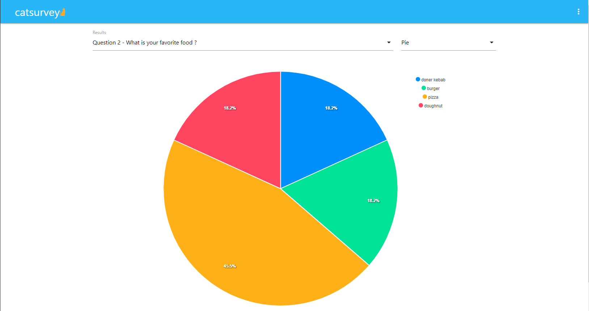
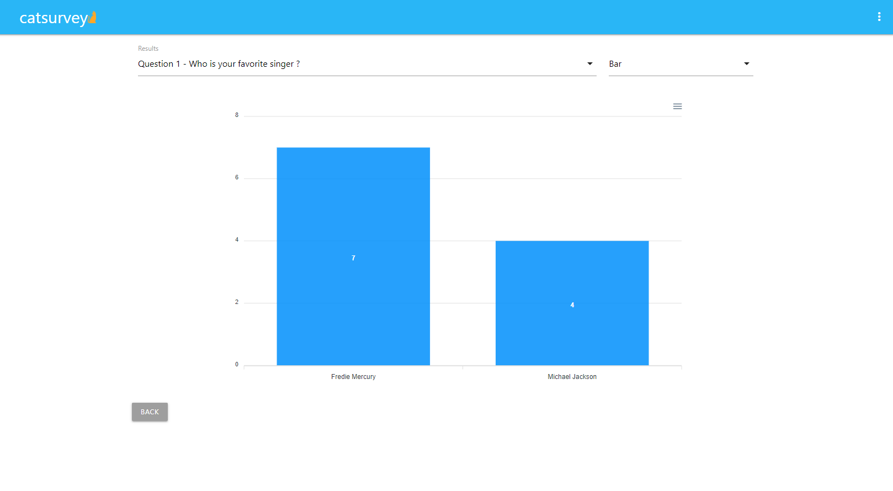

# CatSurvey
Share survey and collect results via react.js and express
> Live demo [_here_](catsurvey.herokuapp.com).
## Table of Contents
* [General Info](#general-information)
* [Technologies Used](#technologies-used)
* [Features](#features)
* [Screenshots](#screenshots)
* [Project Status](#project-status)
* [Room for Improvement](#room-for-improvement)
* [Acknowledgements](#acknowledgements)
* [Contact](#contact)

## General Information
- It is an Survey app for doing researchs and evaluate results.
- Purpose of this project doing researchs efficiently and user friendly.
- I made this project for educational purposes, feel free to use.

## Technologies Used
- MongoDB
- Node.js/Express 
- React.js 

## Features
List the ready features here:
- Create survey
- Share survey
- Get results from your surveys with fancy charts

## Screenshots

<!-- If you have screenshots you'd like to share, include them here. -->

## Project Status
Project is: _in progress_

## Room for Improvement
Include areas you believe need improvement / could be improved. Also add TODOs for future development.

Room for improvement:
- Preventing multiple submit
- More options on question types

## Acknowledgements
Give credit here.
- This project was inspired from https://www.surveymonkey.com

## Contact
gorkemyalcinkaya7@gmail.com - feel free to contact me!
